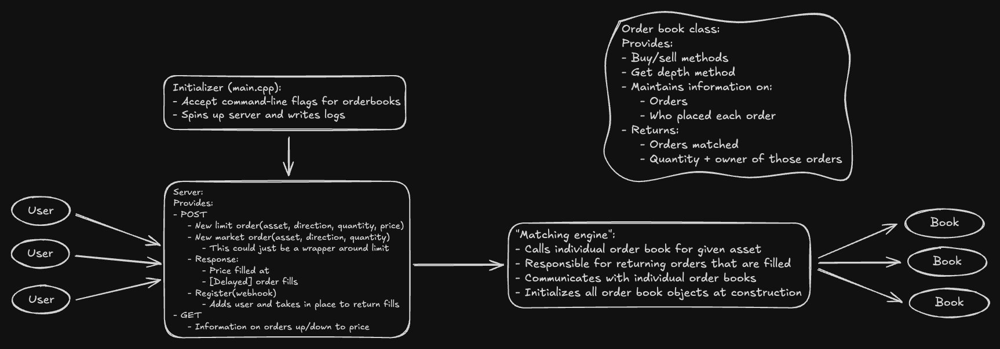

# Orderbook

This is an implementation of an orderbook in C++. It deploys as a web server and exposes a simple API for placing, querying, and cancelling orders. The API (along with the rest of the design) is built as a proof-of-concept, with a focus on understanding the data structures involved in an orderbook and getting the basic operations working. Consequently, I don't plan on adding certain features like auth that, while necessary for deploying to prod, aren't necessary for the book itself.

## Build
Ensure that the [cpr](https://github.com/libcpr/cpr) and [crow](https://github.com/CrowCpp/Crow) C++ modules are installed and findable by CMake. Then, run
```bash
git clone https://github.com/ravibrock/orderbook.git
cd orderbook
cmake -B build && cmake --build build
```
The final binary will be `build/orderbook`.

## Test
The `test/` directory contains some Python scripts used for testing. They are *not* comprehensive, but they do illustrate functionality.

## API Reference
### **Limit Order**
#### **POST /limit/{user}/{direction}/{asset}/{quantity}/{price}**
- Places a limit order.
- **Parameters:**
  - `user` (string): User ID.
  - `direction` (string): `"buy"` or `"sell"`.
  - `asset` (string): Asset name.
  - `quantity` (int): Order size.
  - `price` (int): Limit price.
- **Response:** Order processing result.

---

### **Market Order**
#### **POST /market/{user}/{direction}/{asset}/{quantity}**
- Places a market order.
- **Parameters:**
  - `user` (string): User ID.
  - `direction` (string): `"buy"` or `"sell"`.
  - `asset` (string): Asset name.
  - `quantity` (int): Order size.
- **Response:** Order processing result.

---

### **Update User**
#### **POST /user/{user_id}/{callback}**
- Updates user info with a callback endpoint.
- **Parameters:**
  - `user_id` (string): User ID.
  - `callback` (path): Callback URL or identifier.
- **Response:** If user already existed.

---

### **Get Orders**
#### **GET /orders/{direction}/{asset}/{price}**
- Retrieves orders at a given price.
- **Parameters:**
  - `direction` (string): `"buy"` or `"sell"`.
  - `asset` (string): Asset name.
  - `price` (int): Order price.
- **Response:** Quantity of orders at each price level above (if buying) or below (if selling) given price.

---

### **Add Orderbook**
#### **POST /books/{asset}/{min_price}/{max_price}**
- Adds an orderbook for an asset.
- **Parameters:**
  - `asset` (string): Asset name.
  - `min_price` (int): Minimum price limit.
  - `max_price` (int): Maximum price limit.
- **Response:** Orderbook creation status.

---

### **Cancel Order**
#### **POST /cancel/{order_id}**
- Cancels an order.
- **Parameters:**
  - `order_id` (int): Order identifier.
- **Response:** Cancelled order.

---

### **Shut Down Server**
#### **POST /shutdown**
- Shuts down the server.
- **Response:** Shutdown confirmation.
